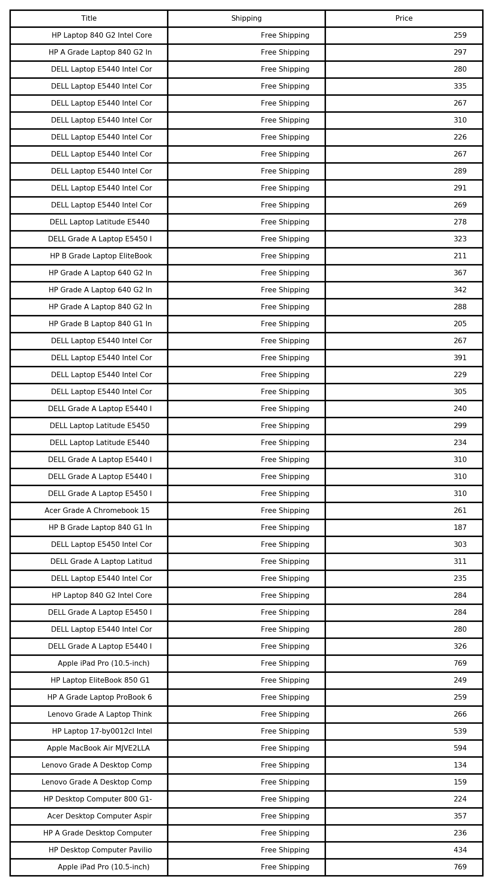

# webScraper
A basic web scraper that scrapes a web page from the provided URL and creates a dataframe with the latest prices of the products listed on the webpage. 

This is suited for websites that do not provide APIs to communicate with their content e.g. small websites.

Further improvements could be to automate the building of all the URLs and the program could just crawl over the URLs.

<object data="https://github.com/prakashabhinav7/webScraper/blob/master/price-table.pdf" type="application/pdf" width="700px" height="700px">
    <embed src="https://github.com/prakashabhinav7/webScraper/blob/master/price-table.pdf">
        
https://github.com/prakashabhinav7/webScraper/blob/master/price-table.pdf

        
This browser does not support PDFs. Please download the PDF to view it: <a href="https://github.com/prakashabhinav7/webScraper/blob/master/price-table.pdf">Download PDF</a>.

    </embed>
</object>
